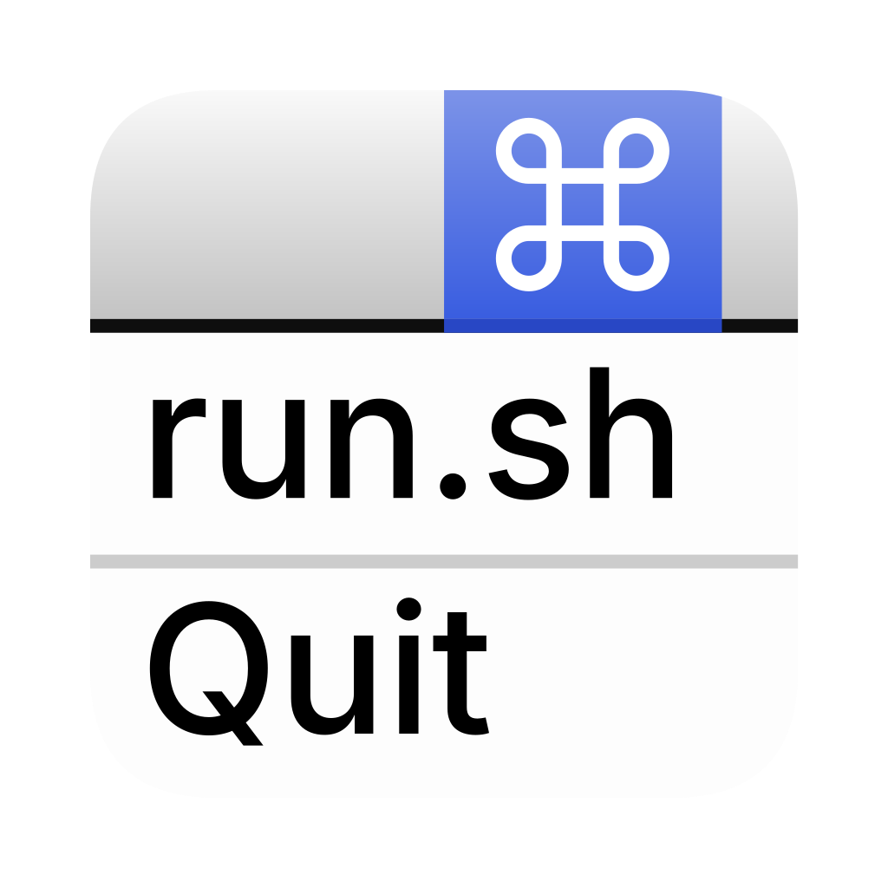
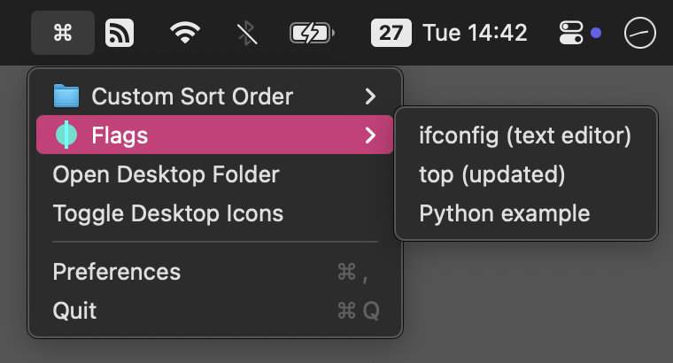

# Menuscript

A menu bar script executor.

Menuscript adds a status bar menu to call custom (user defined) scripts.
The app reads the content of a directory and adds all executable files to the status menu.
The screenshot above represents the content of the [res/examples](res/examples/) directory.

## Usage

1) Define your own script directory in Preferences.
2) Add subdirectories and scripts to your scripts dir.
3) Run a script from your status menu.
4) Depending on your script action, you may want to allow `Full Disk Access` for Menuscript.

*Note:* Menuscript reloads the directory structure each time you open the status menu, no need to restart the app.

### Requirements

Script files are called as is.
Therefore each script __must__ have the executable flag (`chmod 755` or `chmod +x`) and __must__ execute itself on double-click.
The latter can be achieved by adding a shebang (e.g., `#!/bin/sh`) to the script file.
You may want to omit the file extension (in case of Python, that would launch the editor instead of executing the script).

Apart from that, there is no limitation on the script language.
You can use Bash, Python, Swift, Ruby, whatever.
And of course, you can always write a script wrapper to call something else.

=> If you can call the script with `open` (e.g., `open myscript`), it will work in the status menu too.

### Configuration

There are a few ways to modify the menu structure:

#### Menu Icon

A subdirectory can have a custom icon if the folder contains an image file named `icon.X` (where `X` is one of: `svg`, `png`, `jpg`, `jpeg`, `gif`, `ico`, `icns`).

#### Sort Order

By default, menu items are sorted in alphabetic order (case-insensitive).
You can change the item order by prepending numbers to the filename.
It does not matter whether you prepend your files with `42` or `42.` or `42 - `, as long as the first character is a number.

You dont need to rename all items either.
Each item has a default numerical order of `100`.
By prepending a number lower or higher than 100, you can place items at the top or bottom of the menu respectively.

#### Modifier Flags

Modifier flags change what happens if you click on the menu item.
Flags are defined by adding a text snippet to the filename.
These constant strings are defined:

- __[txt]__: Execute the script and dump all output in a new `TextEdit` window (useful for reports or log files, etc.)
- __[verbose]__: Usually, script files are executed in the background.
  With this flag, a new `Terminal` window will open and show the activley running script (useful for continuous output like `top` or `netstat -w`, etc.)
- __[inactive]__: Make menu item non-clickable (will appear greyed out)
- __[ignore]__: Do not show menu item (no menu entry)

